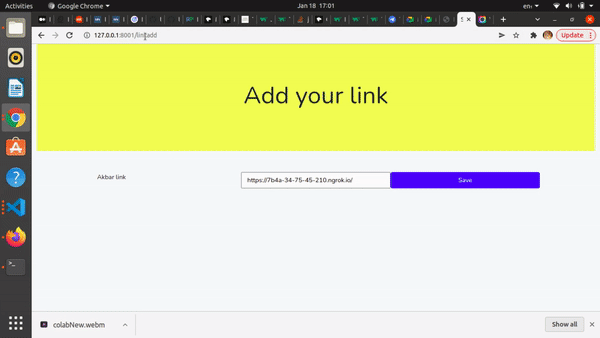

<h1 align="center">
    <b>  Q&A Colab Model</b> 
<br>
</h1>

## What is this for?
This repository give you information about akbar and if you ask any questions about Akbar than it is able to give you answer. 

## Models and technologies used.

The model deepset roberta base squad2 is a Natural Language Processing (NLP) Model implemented in Transformer library, generally using the Python programming language.The model takes a passage and a question as input, then returns a segment of the passage that most likely answers the question.


## Links to references

HuggingFace

https://huggingface.co/deepset/roberta-base-squad2


## Ngrok
[Ngrok](https://ngrok.com/docs) allows you to expose a web server running on your local machine to the internet. Just tell ngrok what port your web server is listening on.


## File Path
Here is the file path for QNA Colab ML Model.
```/Q&A API/Q&A_API.ipynb```

You can use the QNA Colab file in your Colab setup

## Installation
```pip install flask-ngrok```

```pip install pyngrok```

```pip install -U flask-cors```

```pip install flask-ngrok```

```! pip install transformers```

## Instruction
First, set up this repository on your local machine or colab. Installing all dependency in your Machine and authentication your ngrok token.
 
To run 
run all the jupiter or colab cell

To make changes
at line 5 on ```ngrok authtoken "<_YOUR_NGROK_TOKEN_>"``` this is your ngrok token.

To access the API.<br>
```<_YOUR_NGROK_LINK_>/ask?q=<_YOUR_QUESTION_>```


## Laravel and Vue Installation

Clone the Application on your local system.
After cloning the application on your local system use ```cd QNA-Colab-ML-Model``` command to go to the QNA Colab ML model Directory 

Install the default dependencies by running the following command.

```composer update```

```npm install```

## Setting Up Database

First change the default database in ```config/database.php```
Add your database credentials in ```.env``` file.
Run ```php artisan migrate``` to setup your database migration.


## To start your Local server


```npm run dev```

```php artisan serve```


## To Add your Ngrok link 


Open your local server and go to this path:

```http://127.0.0.1:8000/linkadd```


## Sample Video 




## Contributing

If you want to contribute to a project and make it better, your help is very welcome. Contributing is also a great way to learn more about social coding on Github, new technologies and and their ecosystems and how to make constructive, helpful bug reports, feature requests and the noblest of all contributions: a good, clean pull request.


